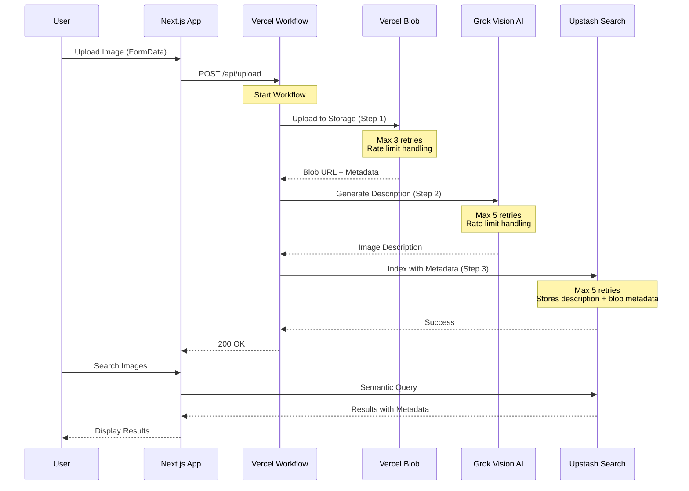

# Vectr 

**Vectr** is an AI-powered image search application template that automatically generates descriptions for uploaded images and indexes them for semantic search.

## ✨ Features

- 📤 **Drag-and-drop image uploads** with Vercel Blob Storage
- 🤖 **AI-powered image descriptions** using Grok 2 Vision
- 🔍 **Semantic search** with Upstash Vector Search (stores metadata too!)
- 🔄 **Resilient processing** with Vercel Workflow automatic retries
- 🎨 **Beautiful UI** built with shadcn/ui and Tailwind CSS
- 💰 **Incredibly cheap** - No database needed!

## 🚀 How It Works

When you upload an image, Vectr automatically:

1. 💾 Stores the image in Vercel Blob Storage
2. 🧠 Generates a detailed description using Grok 2 Vision AI
3. 🔎 Indexes the description AND metadata in Upstash for semantic search



## 🏗️ Architecture

### Workflow Steps

Each step in the image processing workflow is isolated and runs on a separate serverless function with automatic retries:

**Step 1: Upload Image** (`upload-image.ts`)
- 💾 Uploads to Vercel Blob Storage
- ⏱️ Handles rate limiting with 1-minute retry delays
- 🔄 Maximum 3 retry attempts
- ❌ Fatal error on quota exceeded or invalid files

**Step 2: Generate Description** (`generate-description.ts`)
- 🤖 Uses Grok 2 Vision AI to analyze the image
- ⏱️ Handles rate limiting with 5-minute retry delays
- 🔄 Maximum 5 retry attempts
- ❌ Fatal error on invalid/unsupported images

**Step 3: Index Image** (`index-image.ts`)
- 🔎 Indexes description AND blob metadata in Upstash
- 💾 Stores all image data (url, size, contentType, etc.) as metadata
- ⏱️ Handles rate limiting with 1-minute retry delays
- 🔄 Maximum 5 retry attempts
- ❌ Fatal error on invalid data

### Error Handling

Vectr uses sophisticated error handling to ensure reliable processing:

- 🔄 **RetryableError**: Temporary failures (rate limits, network issues, timeouts)
- ❌ **FatalError**: Permanent failures (invalid data, constraint violations)
- 📊 **Context-aware retries**: Each step tracks attempt count and timestamps
- 🎯 **Smart HTTP responses**: 400 for fatal errors, 500 for retryable errors

## 🛠️ Tech Stack

- ⚡ **Framework**: Next.js 15 with App Router and React 19
- 🔄 **Workflow**: Vercel Workflow (alpha)
- 🤖 **AI**: Grok 2 Vision via Vercel AI SDK
- 🔍 **Search & Storage**: Upstash Vector Search (stores metadata too!)
- 💾 **Blob Storage**: Vercel Blob Storage
- 🎨 **UI**: shadcn/ui + Tailwind CSS 4
- 🔒 **Type Safety**: TypeScript + Zod

## 🚀 Deploy to Vercel

The easiest way to deploy Vectr is using the Vercel Marketplace:

[](https://vercel.com/new/clone?demo-description=A+free%2C+open-source+template+for+building+natural+language+image+search+on+the+AI+Cloud.&demo-image=https%3A%2F%2Fvectr.store%2Fopengraph-image.png&demo-title=vectr.store&demo-url=https%3A%2F%2Fvectr.store%2F&from=templates&project-name=Vectr&repository-name=vectr&repository-url=https%3A%2F%2Fgithub.com%2Fvercel%2Fvectr&products=%5B%7B%22type%22%3A%22integration%22%2C%22protocol%22%3A%22storage%22%2C%22productSlug%22%3A%22upstash-search%22%2C%22integrationSlug%22%3A%22upstash%22%7D%2C%7B%22type%22%3A%22blob%22%7D%5D&skippable-integrations=0)

During deployment, you'll be prompted to set up:

1. 🔍 **Upstash Vector Search** - Semantic search + metadata storage
2. 💾 **Vercel Blob Storage** - Image storage

Both services have generous free tiers and will be automatically configured. No database needed!

## 💻 Local Development

### Prerequisites

- 🟢 Node.js 18+
- 📦 pnpm (recommended)

### Setup

1. Clone the repository:

```bash
git clone https://github.com/your-username/vectr.git
cd vectr
```

2. Install dependencies:

```bash
pnpm install
```

3. Set up environment variables:

Create a `.env.local` file with:

```bash
# Upstash Search
UPSTASH_SEARCH_URL="https://..."
UPSTASH_SEARCH_TOKEN="..."

# Vercel Blob
BLOB_READ_WRITE_TOKEN="..."

# AI Gateway Key (only needed locally)
AI_GATEWAY_API_KEY="..."
```

4. Run the development server:

```bash
pnpm dev
```

Open [http://localhost:3000](http://localhost:3000) to see your app.

## 📜 Scripts

- 🚀 `pnpm dev` - Start development server with Turbopack
- 🏗️ `pnpm build` - Build for production
- ✅ `pnpm check` - Run linting checks
- ✨ `pnpm format` - Format code with Biome

## 📁 Project Structure

```
vectr/
├── app/
│   ├── actions/
│   │   └── search.ts                 # Server action for search
│   ├── api/
│   │   └── upload/
│   │       ├── route.ts              # Workflow route handler
│   │       ├── upload-image.ts       # Step 1: Upload to Blob
│   │       ├── generate-description.ts  # Step 2: AI description
│   │       └── index-image.ts        # Step 3: Index with metadata
│   ├── layout.tsx
│   └── page.tsx
├── components/
│   ├── header.tsx
│   ├── results.tsx
│   ├── upload-button.tsx
│   └── uploaded-images-provider.tsx
├── lib/
│   └── utils.ts
└── package.json
```

## 🔐 Environment Variables

| Variable | Description | Required |
|----------|-------------|----------|
| `UPSTASH_SEARCH_URL` | Upstash Vector Search endpoint | Yes |
| `UPSTASH_SEARCH_TOKEN` | Upstash authentication token | Yes |
| `BLOB_READ_WRITE_TOKEN` | Vercel Blob Storage token | Yes |
| `XAI_API_KEY` | xAI API key for Grok Vision | Yes |

## 📊 Observability

Vectr includes comprehensive logging for monitoring and debugging:

- 🔄 `[WORKFLOW]` - Workflow-level events and timing
- 🔧 `[stepId]` - Step-level events with unique identifiers
- 🌐 `[API]` - HTTP request/response logging

All logs include timestamps, attempt counts, and duration metrics.

## 🤝 Contributing

Contributions are welcome! Please feel free to submit a Pull Request. Our [Contributing Guide](.github/CONTRIBUTING.md) has more information on how to get started.

## 📄 License

MIT
